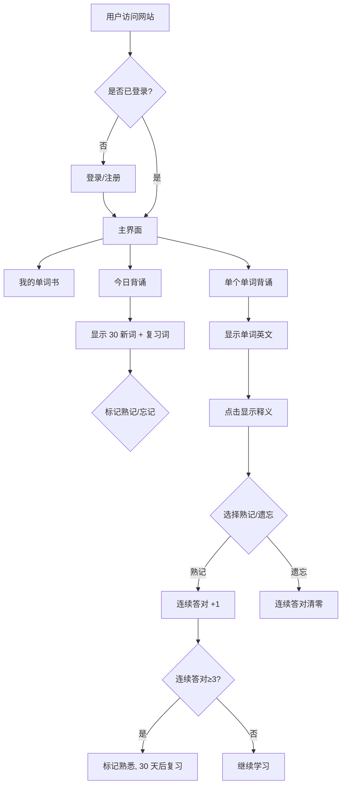

# 单词背诵网站 产品需求文档（PRD）

## 1. 产品概述
- 面向需要高效记忆英语词汇的学习者，基于"间隔重复 + 连续答对判定"机制，帮助用户科学地背诵与复习单词。
- 解决传统背单词无法追踪掌握度、复习时机不科学的问题，目标是让用户通过每日 30 个新词 + 自动复习，长期稳定扩大词汇量。

## 2. 核心功能

### 2.1 用户角色
| 角色 | 注册方式 | 核心权限 |
|------|----------|----------|
| 普通用户 | 邮箱+验证码注册（默认用户名为脱敏手机号） | 登录后背诵、标记单词、查看词库与进度 |

### 2.1.1 登录方式
- 方式一：账号密码登录（账号可为用户名/邮箱/手机号）
- 方式二：邮箱验证码登录

### 2.2 功能模块
1. **登录/注册页**：邮箱+验证码注册（含手机号）、登录支持账号密码或邮箱验证码
2. **主界面（首页）**：三个核心入口卡片——我的单词书、今日背诵、单个单词背诵
3. **我的单词书页**：展示导入词库的所有单词（序号、英文、中文、当前掌握状态）
4. **今日背诵页**：30 个今日新词 + 到期复习词，每个单词后跟"熟记/忘记"标记框
5. **单个单词背诵页**：一次显示一个单词，点击翻面显示释义，可选"遗忘/熟记"

### 2.3 页面详情
| 页面名称 | 模块名称 | 功能描述 |
|----------|----------|----------|
| 登录/注册页 | 表单 | 邮箱+验证码注册、手机号输入；登录可切账号密码/邮箱验证码；错误提示 |
| 主界面 | 三个入口卡片 | 我的单词书 / 今日背诵 / 单个单词背诵，显示今日进度统计 |
| 我的单词书 | 单词列表 | 按序号顺序显示所有单词、英文、中文、掌握状态（新词/学习中/熟悉）、筛选 |
| 今日背诵 | 今日词表 | 30 个新词 + 到期复习词，每行含单词与熟记/忘记状态框，可就地标记 |
| 单个单词背诵 | 翻卡学习 | 显示当前单词英文，点击显示中文释义，下方"遗忘/熟记"按钮，连续答对 3 次标记熟悉 |

## 3. 核心流程

### 3.1 用户流程描述
用户注册登录后进入主界面，可选择三个入口：
- **今日背诵**：系统自动从词库中按序号顺序取出未学过的 30 个新词，并取出到期需复习的单词（熟悉后满 30 天的词），组成今日词表。用户可就地标记每个单词熟记/忘记。
- **单个单词背诵**：进入翻卡式学习，逐个展示今日词表中的单词。先只显示英文，点击后显示中文释义，再选择"遗忘"或"熟记"。每次选择"熟记"会使该词的连续答对计数 +1；选择"遗忘"则计数清零。当某词连续答对 3 次，系统将其标记为"熟悉"，下次复习时间为 30 天后。

### 3.2 流程图


## 4. 用户界面设计

### 4.1 设计风格
- 主色调：深墨绿（#1F3D2B）+ 米白（#F5F1E8）+ 琥珀点缀（#D4A24C），书卷沉稳气质
- 次要色：暖灰用于背景层次
- 按钮：圆角 8px、扁平带轻微阴影；熟记用绿色、遗忘用赭红
- 字体：标题用 "Noto Serif SC" 衬线体（书卷感），正文用 "Noto Sans SC"
- 布局：顶部导航 + 卡片式入口；单词卡居中翻面
- 图标：使用 lucide 风格线性图标（书本、日历、卡片）

### 4.2 页面设计概览
| 页面名称 | 模块名称 | UI 元素 |
|----------|----------|----------|
| 登录/注册页 | 表单卡片 | 居中卡片、衬线标题、输入框、切换链接、错误提示 |
| 主界面 | 入口卡片 | 三列卡片网格，每卡片含图标+标题+今日进度，hover 抬升 |
| 我的单词书 | 单词表格 | 表头：序号/英文/中文/状态；行 hover 高亮；状态彩色徽章 |
| 今日背诵 | 词表 | 每行：序号+单词+熟记/忘记状态框，可点击切换 |
| 单个单词背诵 | 翻卡 | 居中大卡片，正面英文，点击翻面显示中文释义，底部两按钮 |

### 4.3 响应式
- 桌面优先，移动端自适应：卡片网格单列、表格横向滚动、翻卡全宽

### 4.4 动效
- 翻卡使用 CSS 3D transform 翻转
- 入口卡片 hover 抬升 + 阴影渐变
- 标记熟记/遗忘时状态框颜色过渡动画
```
